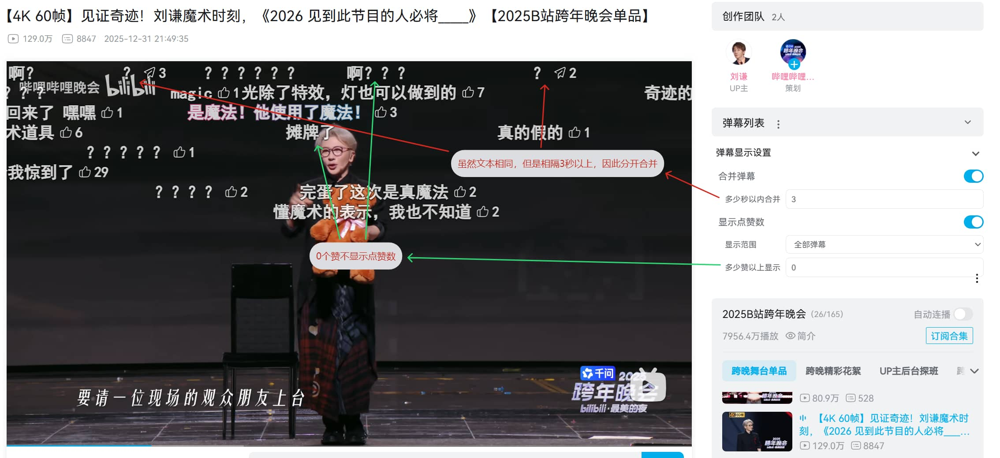

# B站弹幕合并与显示点赞数

在 B 站播放器弹幕旁显示：
- **发送次数**（同文本弹幕合并后的出现次数）
- **点赞数**（实时查询弹幕的点赞数）

## 功能

### 1) 发送次数
- 将相同同文本且相同模式（滚动/顶部/底部）的弹幕进行合并统计
- 在主弹幕右侧显示该内容出现的**次数**
- 其他被合并的弹幕隐藏（但依旧占位）
- 最终点赞数为所有合并弹幕点赞数之和
- 最终颜色为所有合并弹幕颜色混合

### 2) 点赞数
- 查询弹幕**点赞数**并在弹幕右侧显示
- 与“发送次数”可同时显示

### 3) 设置项
- 合并弹幕开关
  - 可设置合并窗口，多少秒以内的才合并。（可以≤0，表示一直合并，效果不太好）
- 显示点赞数开关
  - 显示范围：全部/高赞（B站自己标注的高赞弹幕）
  - 最低点赞数阈值：多少赞以上显示点赞数（可以＜0，0点赞也显示）
- 高亮角标：角标增加一层背景色，更显眼
  - 按热度增亮：合并数与点赞数越高，角标越显眼

> 被合并的弹幕只是不显示，依旧占着弹幕轨道位置，所以不会有补位的弹幕，可以防止弹幕刷屏。

## 安装

**插件地址**：[Tampermonkey](https://www.tampermonkey.net/)

**脚本地址**：
- [Github主页](https://github.com/ZBpine/bili-danmaku-adapt)
- [GreasyFork](https://greasyfork.org/zh-CN/scripts/561067)
- [ScriptCat](https://scriptcat.org/zh-CN/script-show-page/5016)

## 参考

- [bilibili-API-collect](https://github.com/SocialSisterYi/bilibili-API-collect)
- [油猴教程-工程篇](https://learn.scriptcat.org/油猴教程/工程篇/)、[油猴webpack开发插件](https://bbs.tampermonkey.net.cn/forum.php?mod=viewthread&tid=1191)

详情见[开发过程](./开发过程.md)